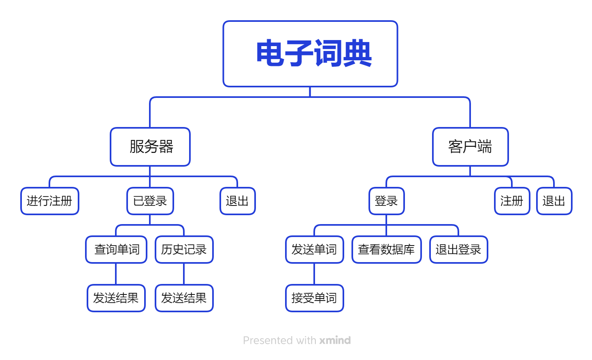

# **项目需求**

1. 将dict.txt的数据导入到**数据库**中保存
2. 登录注册功能，不能重复登录，重复注册
3. 单词查询功能
4. 历史记录功能，存储单词，意思，以及查询时间
5. 基于**TCP**，支持多客户端连接
6. 采用数据库保存用户信息与历史记录
7. 按下ctrl+c退出客户端后，注销该客户端的登录信息

# 项目逻辑

# 通信协议

- 用户注册：发送数据第一位为**0**，后跟用户名**`usr`**或**`passwd`**字符串数据，以**\0**结尾。

​		如果注册成功返回**1**，注册失败返回**0**。

- 用户登录：发送数据第一位为**1**，后跟用户名**`usrname`**和**`passwd`**字符串数据，中间以数字**\0**分割，最后以**\0**结尾。

- 用户上传单词：发送数据格式为**2、单词数据、\0**。

- 服务器发送单词和翻译：数据格式为**单词、\0、翻译、\0**，如果单词不存在，则发送**0**。

  

# 函数模块

#### 客户端：

- 用户注册**do_register**：向服务先发送账号数据，以**0**为数据开头后接账号，再发送密码数据也以**0**为数据开头后接密码,都以**\0**结尾。

  返回**0**表示函数运行成功，返回-**1**表示函数运行出错，返回-**2**表示连接已断开需要重新连接。

- 用户登录**do_login**：向服务器发送账号密码数据，数据格式为**1、账号、0、密码、\0**。

  返回**1**表示函数运行成功，返回-**1**表示函数运行出错，返回-**2**表示连接已断开需要重新连接，返回**0**表示账号密码错误。

#### 服务端：

- 处理用户注册**do_register**：返回**0**表示函数运行成功，返回-**1**表示函数运行出错，返回-**2**表示连接已断开需要重新连接。
- 处理用户登录**do_login**：返回**0**表示函数运行成功，返回-**1**表示函数运行出错，返回-**2**表示连接已断开需要重新连接。

